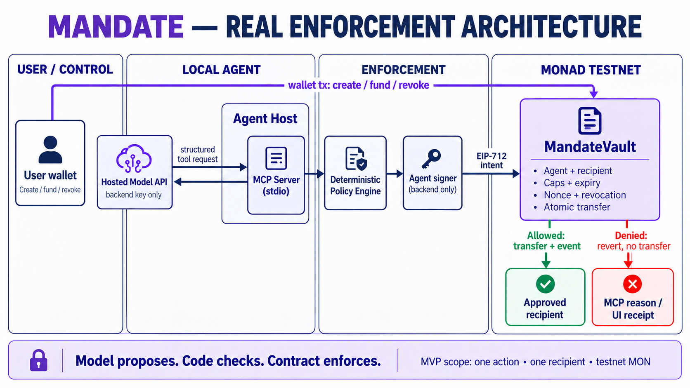
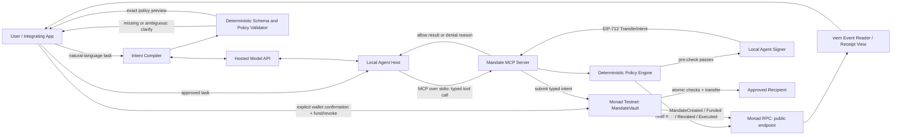

# Mandate — Backend Architecture and Implementation Status

**Status:** Architecture baseline implemented as a local vertical slice; testnet deployment, live inference, and bounded execution are verified, while wallet UI acceptance remains pending.
**Purpose:** Record trust boundaries, the contract/API shape, implementation evidence, and remaining proof gates.  
**Track:** Metropolis Track 04 — Trust, Identity & AI Infrastructure.  
**Cost model:** Monad Testnet, public RPC, and local tooling remain the low-cost base; live inference uses a hosted model API and may incur variable token charges. Provider and hard spend cap must be confirmed before billing is enabled; see [`FREE_RESOURCES.md`](FREE_RESOURCES.md).



> **Product rule:** Mandate is an executable authorization primitive, not a demo dashboard. The reference UI only operates the same contract and gateway that an integrating agent uses. No screen, mock response, or model instruction is the security boundary.

## Implementation status — 2026-10-04

Implemented packages follow this design: `contracts/MandateVault.sol`, `packages/policy`, `packages/intent-compiler`, `packages/mandate-sdk`, `packages/mcp-server`, and `apps/console`. Evidence includes deterministic TypeScript tests, Foundry invariants, local Anvil + MCP stdio end-to-end checks, and Monad Testnet transfer/deny/revoke/withdraw receipts. Model inference is currently disconnected from the runtime and browser-wallet acceptance remains a separate operational gate.

## 1. Executive architecture decision

Build one narrow, real, end-to-end path first:

1. A user describes a task in natural language, such as “let my payment agent send Alice up to 10 MON before 8 PM.”
2. A hosted model API proposes a typed candidate policy. A deterministic compiler validates and normalizes it; missing agent identity, recipient address, budget meaning, date/timezone, or other required values trigger clarification rather than a guess.
3. The UI shows the exact policy: principal, registered agent, allowed action, fixed recipient, asset, per-transfer cap, total budget, expiry, nonce/version, and any call limit. The user can edit or reject it, then confirms the exact policy with their wallet. Only this explicit confirmation creates the Mandate on Monad Testnet. Store normalized fields and an optional policy commitment, never raw prompt text.
4. The user funds the mandate vault with testnet MON. A local agent host calls the hosted model API through a backend-only provider adapter and launches Mandate’s MCP server over **stdio**. The model receives only narrow `request_bounded_transfer` and read-only `get_mandate_status` tools; it never receives a signing key.
5. The MCP server’s deterministic policy layer validates the typed request and reads the current onchain mandate. A backend-held agent signer signs a typed transfer intent only after the local pre-check passes.
6. The Monad contract independently verifies the EIP-712 intent and checks active/revoked state, agent signer, approved recipient, per-call limit, cumulative limit, expiry, nonce, and deposited balance in the same transaction that transfers MON.
7. A successful transfer emits an onchain execution event. A rejected call has no transfer and no persistent spending/nonce mutation; the MCP response gives a stable denial reason. Reverted transaction hashes may be shown as failed attempts, but reverted logs are not described as persistent onchain denial receipts.
8. The principal can revoke onchain at any time. Every later execution is rejected by the contract even if a stale MCP process or model asks again.

This design keeps the demo honest: the chain is the final enforcement layer for the value-moving action, while the AI runtime is replaceable and untrusted.

## 2. Scope and architecture qualities

### MVP is

- A developer-facing **MandateVault contract + typed TypeScript client + MCP server**.
- A natural-language intent compiler that proposes a typed policy, asks clarification for ambiguity, and produces an exact user-reviewed preview.
- A testnet-native MON transfer from an escrowed mandate balance to one fixed approved recipient.
- One local agent workflow and one signing path, with EIP-712 agent action intents.
- Deterministic policy decisions, explicit denial reasons, replay protection, revocation, and auditable successful events.
- A small control surface only if time permits; it cannot substitute for the contract, SDK, or MCP integration.

### MVP is not

- A general-purpose wallet, arbitrary contract-call executor, or open-ended tool proxy.
- A claim that all web/API actions are protected. The first protected side effect is deliberately onchain and performed by the contract. Extending to offchain APIs requires a gateway that owns the downstream credential and never exposes a bypass path.
- An ERC-8004 registry, reputation marketplace, passkey wallet, account-abstraction system, relayer network, or multi-chain policy engine. Those are adapters/future work, not dependencies of the enforcement proof.
- An LLM as an authorization dependency. A hosted model proposes policy fields and tool calls, but deterministic validation and explicit user confirmation create the authority; every policy case must be testable without API calls.

### Target architecture qualities

1. **No model authority:** model output is an untrusted policy proposal, never a mandate or permission. Only the user confirms the canonical policy with their wallet.
2. **Defense in depth:** gateway pre-checks for fast, useful errors; contract checks atomically before every transfer.
3. **Least authority:** one registered agent, one recipient, one action type, finite per-transfer and total budgets, finite expiry.
4. **No bypass in the claim:** funds for the demo are held by the vault, not in a general agent wallet.
5. **Replay-safe:** typed intent binds the chain, verifying contract, mandate, recipient, amount, nonce, and deadline.
6. **Privacy-minimizing:** raw prompts and task text stay offchain but are sent to the selected API provider; minimize/redact them and review provider retention settings. Store only normalized policy fields and an optional commitment onchain. API secrets stay backend-only and are never sent in prompts; events expose only fields needed to verify transfers.
7. **Cost-bounded:** contracts, deterministic tests, and tools run locally; hosted inference for natural-language policy proposals and live agent reasoning is metered and bounded by configured token/call/spend limits; deterministic tests require no API.
8. **Composable:** another application can call a typed SDK/contract interface without adopting Mandate's UI or model provider.

## 3. System context and component diagram



The user-confirmed policy is the sole source of authority. The intent compiler can only suggest its fields; deterministic validation and wallet confirmation create the Mandate. `MandateVault` is the authority source for onchain policy and balances. The policy engine improves tool behavior but is not trusted to enforce the transfer by itself. The chain contract is the final guard.

## 4. Trust boundaries and key ownership

| Component | Trust assumption | Keys/secrets | May do | Must not do |
|---|---|---|---|---|
| User wallet | User controls the wallet and reviews mandate setup | User wallet secret stays inside wallet software | Create/fund/revoke mandates; withdraw remaining funds after revocation | Give its private key or unrestricted signing access to the model |
| Hosted model API / intent compiler | **Untrusted proposer**; may misread, omit, or be manipulated | Provider API key held server-side; no wallet or agent key | Propose typed policy fields and action calls; request clarification | Create/approve a mandate, invent trusted identity, resolve ambiguity by guessing, read signing key, or bypass contract |
| MCP server / policy engine | Local, trusted enough to give the agent access to the narrow operation; still treated as bypassable by contract | Agent key is local backend-only; RPC URL public | Validate tool input, read chain, pre-check, sign fixed action intent, submit contract call | Accept arbitrary calldata, expose signing key to tool result/model, log private prompt content |
| Agent signer | Dedicated demo signer, scoped onchain by the contract | Local environment/config; never browser code or repo | Sign EIP-712 intent for registered mandate | Hold user funds outside the vault or independently transfer vault funds |
| MonadVault contract | **Final policy enforcement** for the MVP transfer | No secret keys | Check policy atomically, update state, transfer only on valid intent | Trust an offchain `allowed=true` flag; execute arbitrary calldata |
| Public RPC / explorer | Read/submit transport, not policy authority | No secrets in URL for public endpoint | Read public chain state, broadcast signed transaction | Be treated as source of policy truth over contract state |
| Intent preview UI | Presents canonical fields for review | Browser wallet access mediated by wallet provider | Show unresolved fields; let user edit/reject; request explicit wallet signature for exact policy | Treat model output as approved, hide defaults, or submit policy without confirmation |
| Local UI and event reader | Presentation/client only | Browser wallet access is mediated by wallet provider | Create/revoke via explicit wallet actions; display chain state | Pretend a local cache is current, mark pending tx as final, enforce policy alone |

### Agent key model

For the MVP, generate or configure one dedicated agent EOA in the local backend process. Its private key never enters model context, MCP tool arguments/results, frontend code, telemetry, or Git. The onchain mandate constrains what that key can accomplish **through MandateVault**. The key must not be funded as a general-purpose wallet; it only needs testnet MON for its own gas if it submits transactions. The user principal funds the mandate vault separately.

For a hackathon demo, use a throwaway Testnet key and a local `.env` excluded from Git. This is a test setup, not production key custody. A production design would replace it with a wallet/agent-signing integration and separate review of key storage, rotation, recovery, relaying, and account abstraction.

The local setup must make the public agent address discoverable before the user creates a mandate—for example, a local setup command or local control panel can display/copy it. Only the public address goes into the mandate. The private key remains in the backend process configuration and is never sent to the browser or model.

## 5. Contract boundary and state model

### One contract for the vertical slice

Start with one small `MandateVault` contract instead of a registry + executor + separate vault. Fewer trust boundaries and fewer moving parts make the enforcement path easier to reason about and test. Split contracts only when a concrete integration requires it.

### Mandate state (proposed)

```text
Mandate {
  principal: address                 // user who created it
  agentSigner: address               // local agent EOA public address
  approvedRecipient: address         // one recipient in MVP
  perCallLimit: uint256              // wei
  totalLimit: uint256                // wei
  spent: uint256                     // wei, monotonically increases on success
  expiresAt: uint64                  // Unix timestamp
  nextNonce: uint256                 // strict sequence, starts at 0
  active: bool                       // false on revocation
  policyHash: bytes32                // commitment to canonical user-approved policy (optional MVP field)
  deposited: uint256                 // escrowed native MON
}
```

`policyHash` commits to a versioned canonical representation of the exact policy the user reviewed; it is not a substitute for storing/checking enforceable fields. `mandateId` may commit to the owner, agent, recipient, policy fields, salt, and chain/contract context, or be a monotonic ID held by the verifying contract. Final choice must be settled before implementation. Never put raw task text or personal data in either hash input or public events.

### Minimum external contract API

| Function | Caller | Effect |
|---|---|---|
| `createMandate(agentSigner, approvedRecipient, perCallLimit, totalLimit, expiresAt, policyHash, salt)` | Principal wallet | The wallet transaction confirms the exact previewed policy and creates an active mandate. Reject zero addresses, invalid limits, expired/too-long lifetime, and duplicate salt/ID. |
| `fundMandate(mandateId)` payable | Principal | Adds native Testnet MON, capped by the remaining mandate budget. |
| `revokeMandate(mandateId)` | Principal only | Permanently deactivates the mandate; no reactivation in MVP. |
| `executeTransfer(intent, signature)` | Anyone may relay; signature authorizes it | Atomically verifies intent and agent signature, enforces scope/budget/nonce/expiry/balance, updates state, transfers to the fixed recipient, and emits success. Any invalid condition reverts with a custom error and no lasting state change. |
| `withdrawAfterRevoke(mandateId)` | Principal only | Withdraws unspent deposit only after revocation. Keep the rule simple and test that revocation blocks later execution. |
| `getMandate(mandateId)` | Public read | Returns the minimal current policy/state needed by the client and MCP pre-check. |

`executeTransfer` does not accept arbitrary `to` plus arbitrary `data`; the recipient is fixed in mandate storage and the only side effect is a native MON transfer. A later generalized capability system must keep an explicit tool/contract/function allowlist rather than adding a generic `call(target, data)` escape hatch.

### Intent-to-policy compilation and user confirmation

The compiler returns a typed candidate with explicit unresolved fields; it never produces a callable authorization. A JSON schema validates shape, while deterministic semantic rules validate supported values and relationships; neither can prove that the model understood every nuance of the original sentence, so the user must review the complete preview. A deterministic validator checks schema version, addresses, supported action, MON-to-wei conversion, per-call/total relationships, expiry timestamp/timezone, limits, and policy hash construction. If a field cannot be deterministically normalized (for example “by 8 PM” without a date/timezone, or “up to 10 MON” without clarifying per-call versus aggregate), return a clarification question and do not call `createMandate`. The UI displays the exact normalized fields and material assumptions; the principal wallet’s `createMandate` transaction is the confirmation. Keep raw natural-language text offchain and avoid retaining it unless needed and disclosed.

### EIP-712 transfer intent

Proposed typed message:

```text
TransferIntent(
  bytes32 mandateId,
  address recipient,
  uint256 amount,
  uint256 nonce,
  uint64 deadline
)
```

Use the EIP-712 domain with a product name/version, chain ID, and `verifyingContract`. The contract recovers the signer and requires it to equal the mandate's registered `agentSigner`. The exact type hash and ABI encoding must be shared from generated/typed definitions and tested against Solidity. The contract must also require `recipient == approvedRecipient`; do not rely on the signature alone to encode all policy.

OpenZeppelin's `EIP712` and `ECDSA` utilities are suitable implementation references. Their documentation explains chain-aware domain separation and signer recovery; `ReentrancyGuard` is available for external-call protection. Use the version in the lockfile and validate the current Monad compiler/runtime compatibility before writing code. Sources: [OpenZeppelin cryptography](https://docs.openzeppelin.com/contracts/5.x/api/utils/cryptography) · [OpenZeppelin utilities](https://docs.openzeppelin.com/contracts/5.x/api/utils).

### Atomic execution algorithm

1. Load the mandate; require it exists, is active, and is not expired.
2. Require the intent mandate ID, recipient, amount, nonce, and deadline match current state and mandate policy.
3. Recover the EIP-712 signer and require the registered agent signer.
4. Require `amount > 0`, `amount <= perCallLimit`, `spent + amount <= totalLimit`, and enough deposited balance.
5. Update spent, deposit accounting, and `nextNonce` before transferring (checks-effects-interactions); protect the function against reentrancy.
6. Transfer native MON to the exact approved recipient. Revert if transfer fails so every state update rolls back.
7. Emit `TransferExecuted(mandateId, nonce, recipient, amount, signer)`; never emit prompt or private input.

The EVM transaction's atomicity is the decisive safety property: an invalid call cannot partially consume the budget or move funds. The UI waits for a mined successful receipt before displaying “executed.”

## 6. MCP gateway and backend API

### Process layout

```text
apps/console          React + Vite static client, wallet connect, mandate forms, event view
packages/policy       schemas, normalized intent, error/decision codes
packages/mandate-sdk  typed viem reads/writes, EIP-712 construction, receipt parser
packages/mcp-server   local stdio server, backend-only signer, fixed tool handlers
contracts             MandateVault + Foundry unit/fuzz/invariant tests
scripts               local demo, testnet deploy, deterministic attack scenarios
docs                  architecture, threat model, integration guide, test evidence
```

Keep `packages/policy` pure and deterministic. Keep the agent runtime/model adapter behind a small interface so hosted API providers can be swapped without changing authorization; deterministic tests do not call a model.

### MCP tool surface (MVP)

| Tool | Input | Side effect | Important boundary |
|---|---|---|---|
| `get_mandate_status` | `mandateId` | Read-only | Returns current onchain active/expired state, scope, limits, spent/remaining, and chain. Does not expose secrets. |
| `request_bounded_transfer` | `mandateId`, `amount` | Potentially submits one transaction | Recipient is read from the mandate, never selected by the model. Gateway pre-checks, signs one typed intent, and contract re-checks. Result states mined success or exact denial/failure class. |

Do not include user-controlled `agentSigner`, `recipient`, `contractAddress`, `functionData`, arbitrary URL, or raw private-key fields in the action tool schema. Determine signer/config from server-side local configuration, and verify the signer against onchain mandate state.

If built with the current MCP TypeScript SDK v2, define tools with a strict Zod input schema and use the official `serveStdio` entry. Its docs state schemas are validated before the handler executes and that stdio `stdout` is the JSON-RPC channel, so diagnostic logs must go to `stderr`. Sources: [MCP TypeScript SDK v2](https://ts.sdk.modelcontextprotocol.io/v2/) · [first server](https://ts.sdk.modelcontextprotocol.io/v2/get-started/first-server) · [stdio](https://ts.sdk.modelcontextprotocol.io/v2/serving/stdio).

### Policy decision pipeline

```text
MCP JSON input
   → Zod schema validation
   → normalize units/addresses/integers (reject ambiguous decimals)
   → derive agent signer from backend config, not model input
   → read current mandate from Monad
   → deterministic pre-checks with typed reason code
   → create EIP-712 intent with monotonic nonce/deadline
   → sign with local agent signer
   → submit typed executeTransfer call
   → wait for receipt, decode success/custom error
   → return minimal structured result to model + detailed UI-safe result
```

Never make authorization decisions from the model's natural-language explanation or a cached balance. If the chain read is unavailable, the signer/config is missing, or a receipt is ambiguous, fail closed and do not claim execution.

## 7. Data flow and persistence

| Data | Where it lives | Onchain? |
|---|---|---|
| Mandate owner, agent signer, recipient, caps, expiry, active flag, spent/nonce/deposit | Contract storage | Yes, minimal fields needed for enforcement |
| Typed action intent | MCP process memory until submitted; transaction calldata/signature public if broadcast | Intent fields/signature are public onchain; use no secret or private prompt text |
| Original request and clarification history | Offchain UI/backend; only minimal text sent to hosted model provider; retention follows provider terms | No |
| Canonical policy proposal and user review | Client/backend until confirmed; normalized fields + optional hash committed onchain | Fields yes; raw prompt no |
| Agent private key | Local backend environment/keystore, excluded from Git and model context | No |
| UI convenience cache and event cursor | Browser memory or local SQLite/JSON | No; always reconcile against contract/RPC |
| Successful execution event | Monad receipt/log | Yes: mandate ID, nonce, recipient, amount, signer |
| Local denial diagnostics | MCP stderr / local structured log, with input minimization | No persistent chain event in MVP |

Avoid a hosted database/indexer and analytics SDK in the MVP. Read current contract state and a bounded range of events directly with viem/public RPC. If data volume makes that impractical later, document a local indexer or self-hosted option rather than adding a paid service as a hidden dependency.

## 8. Failure behavior

| Failure | Expected outcome |
|---|---|
| Invalid MCP schema, negative/fractional/overflow amount | Reject before chain call; return `INVALID_ARGUMENT`. |
| Unknown, expired, inactive, wrong-agent, wrong-recipient, over-cap, exhausted budget, wrong nonce | Reject in pre-check with stable reason; contract independently rejects if request is submitted anyway. |
| RPC unavailable or stale/ambiguous chain read | Fail closed; no signing/submission; report `CHAIN_UNAVAILABLE` or `STATE_UNCONFIRMED`. |
| Agent key missing or signer mismatch | Fail closed; never prompt model to obtain key; return `SIGNER_NOT_CONFIGURED` / `SIGNER_MISMATCH`. |
| User revoked after gateway pre-check (race) | Contract sees current state during execution and reverts; no recipient transfer or persisted spend. |
| Transfer recipient rejects native MON | Transaction reverts; spent/deposit/nonce updates roll back. |
| Transaction pending/timeout | Report `PENDING` until confirmed; do not claim success or automatically send a duplicate with the same nonce. Reconcile by tx hash and nonce. |
| Model emits malformed tool call or retries | Schema/policy check repeats. Contract nonce makes duplicate intent unusable after successful execution. |

## 9. Threat model and invariants

### Threats in MVP scope

- Prompt injection or model error proposes an unauthorized policy/action.
- Ambiguous language, timezone conversion, currency interpretation, or omitted agent/recipient gets silently guessed into a wider mandate.
- Tool arguments attempt address/amount manipulation or confusing numeric forms.
- Agent intent signature replayed across mandates, chains, contracts, or transactions.
- Old/cached mandate state after expiry or revocation.
- Compromised/stale MCP process attempts to bypass local pre-check.
- Reentrancy or recipient failure during native token transfer.
- RPC/model outage, transaction timeout, duplicate retry, or misleading UI status.
- Accidental exposure of agent key, prompts, or sensitive input through logs, events, screenshots, or the public repository.

### Security invariants (must become tests)

1. **No valid mandate, no transfer.**
2. **Only explicit principal confirmation can create authority:** a model proposal alone never creates or widens a Mandate.
3. **Only the mandate principal can fund, revoke, or withdraw its mandate balance.**
4. **Only the registered agent signer can authorize the exact typed action; user/model-supplied signer addresses are ignored.**
5. **No action can exceed the approved recipient, per-call cap, total cap, deadline, or current remaining deposit.**
6. **A successful nonce is consumed once; failed transactions consume no state because they revert atomically.**
7. **Revocation and expiry are checked by the contract at execution time.**
8. **No arbitrary call path exists in the MVP contract or MCP server.**
9. **Model output never contains private signing material.**
10. **No prompt, secret, or private user payload is written onchain.**
11. **UI “success” requires a mined successful receipt from the configured Monad chain and expected contract.**

### Deliberate limits

The MVP protects only actions that go through its tools and contract. A user-funded EOA or a separate API key that an agent can access outside this path is not protected by Mandate. Offchain API execution must be a separately designed adapter that keeps the API credential inside the gateway and checks policy immediately before the API side effect.

## 10. Testing strategy before deployment

Use Foundry unit, fuzz, and invariant tests plus TypeScript policy/MCP tests. Keep tests deterministic and runnable without an LLM or public RPC.

| Layer | Tests |
|---|---|
| Solidity unit | create/fund/revoke/withdraw authorization; exact successful transfer; approved-recipient only; per-call cap; cumulative cap; expiry boundary; missing/incorrect signature; incorrect signer; chain/contract domain separation; nonce sequence; replay; insufficient deposit; rejecting recipient; reentrancy attempt; revert restores spent/deposit/nonce. |
| Solidity fuzz/invariant | For arbitrary amounts/nonce/recipient/time, a successful execution always preserves `spent <= totalLimit`, `spent <= total funded budget`, and fixed recipient scope; revoked/expired mandates never transfer. |
| Policy package | Valid/invalid schema; address normalization; bigint/decimal conversion; stable denial codes; cached/stale state never authorizes; signer is server config only. |
| MCP server | Tool schemas expose no arbitrary recipient/calldata/key; invalid request does not call signer/RPC; stdout contains only protocol messages; logs on stderr; model/tool retries are safe. |
| SDK/client | EIP-712 digest agrees with Solidity vector; wrong chain/contract fails; decoded custom errors/events are stable. |
| End-to-end Testnet | User creates and funds; allowed call transfers and event appears; excess and wrong-target calls do not transfer; revoke then retry fails; explorer transaction/contract verified. |
| Cold-start integration | Another developer clones public repo, follows README, runs local tests and MCP Inspector, then exercises the deployed testnet workflow. |

Do not claim a security audit from passing local tests. Before any mainnet use, obtain independent contract review and add monitoring/recovery/security design outside the hackathon MVP.

## 11. Implementation sequence and current phase status

**Current status:** Phase 0 design is recorded; Phase 1–3 have a local implementation and tests; Phase 4 has a deterministic compiler, provider adapter, and console but live inference remains unconfigured; Phase 5 Testnet proof is pending. Solidity fuzz/invariant properties and MCP Inspector validation are also pending.

### Phase 0 — architecture sign-off (this document)

- Confirm one action, one contract, one chain, one agent signer, one recipient, one user flow.
- Confirm what the contract enforces vs what the MCP gateway only pre-checks.
- Freeze policy fields, EIP-712 typed data, custom errors, event shape, and acceptance tests before backend modules are scaffolded.

### Phase 1 — contract specification and tests

- Create a Monad-configured Foundry repo from the official Monad starter.
- Add canonical policy schema/version, user-preview requirements, ambiguity/clarification cases, and a `policyHash` encoding test vector.
- Add `MandateVault` interface, custom errors/events, and threat-model comments.
- Write failing unit/fuzz tests for the invariants before implementing transfer logic.
- Implement and pass local Foundry tests; do not deploy before negative cases pass.

### Phase 2 — typed client and deterministic policy

- Generate TypeScript types/ABI from the contract build.
- Implement typed EIP-712 payload generation and cross-language signature test vectors.
- Implement amount parsing in integer wei only and stable error/reason codes.
- Test policy logic with current chain state and fail-closed transport behavior.

### Phase 3 — MCP action boundary

- Build the stdio MCP server using the current supported TypeScript SDK documented in `FREE_RESOURCES.md`.
- Add only `get_mandate_status` and `request_bounded_transfer` initially.
- Keep agent signing isolated in backend-only code; never expose signer configuration through MCP.
- Run the real tool through MCP Inspector with deterministic inputs before adding an LLM.

### Phase 4 — intent compiler, hosted AI + integration UI

- Add a provider-neutral hosted API adapter with structured policy extraction and tool calling, strict token limits, timeouts, bounded retries, per-run call caps, usage accounting, and a hard spend stop. Keep the API key in the backend environment only.
- Implement the ambiguity/clarification loop and canonical policy preview. No model response can trigger wallet signing or `createMandate`; the principal confirms the exact policy.
- Evaluate the selected model on representative and adversarial language; malformed output still fails deterministic validation, and ambiguous input yields a question rather than guessed authority.
- The same MCP server and contract must work with a scripted no-model harness, with no API key or API call.
- Add the smallest viable UI for wallet creation/funding/revocation and receipt verification. Build this after the backend path works.

### Phase 5 — Testnet proof and hackathon package

- Deploy to Monad Testnet with faucet MON only; publish contract address and transaction hashes.
- Re-run the acceptance matrix against the deployed bytecode.
- Ask another developer to integrate the SDK/MCP path; capture concrete feedback.
- Publish the code, setup/license/attribution/AI-tool disclosure, architecture/threat model, live product link, Track 04 project graphic, 3-minute technical demo, and 2-minute pitch video.

## 12. Required evidence and definition of done

The local vertical slice is implemented, but release completion requires all of the following:

- `forge test` passes including the negative and invariant cases.
- Unit tests prove a rejected request produces no transfer and no lasting allowance/nonce changes.
- MCP Inspector can call the actual server and receives typed structured status/denial results.
- The exact same policy tests run without API calls; candidate policies require explicit wallet confirmation and hosted model output cannot bypass gateway/contract checks.
- The local UI, SDK, MCP server, and contract use the same mandate ID and definitions.
- A real Monad Testnet transaction proves allow, and contract-level failures prove over-limit/revoked denials.
- Public repo instructions work from a clean clone; no secrets are committed, and live API usage is configured under a documented hard spend ceiling.
- Track 04 proof artifacts and developer validation are ready for the portal.

## 13. Decisions intentionally deferred

- **ERC-8004:** identity adapter after core signer binding works; never a replacement for the contract's authorization checks.
- **Passkey/P256:** later signer option; EOA/EIP-712 is the smallest testable first path. Monad Track 04 calls out native P256 support, so revisit if the basic vertical slice is complete early.
- **Model API provider:** not configured in the current runtime. Re-enable inference only after confirming provider endpoint, model ID, authentication/request schema, billing limits, privacy/retention, and regional access. Keep all credentials server-side; deterministic tests remain provider-independent.
- **General tools/offchain APIs:** later, with a credential-owning gateway and a separate threat model per connector.
- **Onchain denial events:** not in MVP. Reverted calls have no persistent logs; local denial logs remain local. Do not add a public event method that falsely suggests an arbitrary self-reported denial proves the blocked side effect.
- **Hosted deployment/indexing:** defer. Use local MCP stdio, public Monad Testnet RPC, and direct event reads for the hackathon proof.

## 14. Research references

- [Monad Testnet documentation](https://docs.monad.xyz/developer-essentials/testnet) — verify chain/RPC details at implementation time; the free-resource note lists Testnet chain ID `10143`.
- [Monad Metropolis Track 04](https://hackathon.monad.xyz/tracks/trust-identity-ai) — portal-authenticated track description, judging criteria, and Track 04 deliverables.
- [Hackathon rules and guidelines](https://hackathon.monad.xyz/dashboard) — portal Rules & Guidelines panel, version 3.0, last updated 3 September 2026; re-open in the portal before submission.
- [MCP TypeScript SDK v2](https://ts.sdk.modelcontextprotocol.io/v2/) · [first server](https://ts.sdk.modelcontextprotocol.io/v2/get-started/first-server) — tool schema validation and stdio server setup.
- [OpenZeppelin EIP-712/ECDSA](https://docs.openzeppelin.com/contracts/5.x/api/utils/cryptography) · [ReentrancyGuard](https://docs.openzeppelin.com/contracts/5.x/api/utils) — typed signatures, signer recovery, and external-call protection.
- [EIP-712 specification](https://eips.ethereum.org/EIPS/eip-712) — typed structured signing and domain separation.
- [`README.md`](README.md) — project and submission overview.
- [`FREE_RESOURCES.md`](FREE_RESOURCES.md) — infrastructure resources and API cost boundaries.
- [`TECH_STACK.md`](TECH_STACK.md) — workstation-specific stack rationale, trade-offs, pinning, and upgrade triggers.

## Generic capability authorization foundation (2026-10)

The four fixed workspace task categories have been removed. The workspace now accepts a general task brief and presents an action selector backed by the currently registered UI capability catalog. That catalog currently contains only `monad.native-transfer`; it is not a claim that other tasks can be executed.

`packages/connectors` introduces the typed backend foundation:

- versioned connector/action manifest descriptors, strict Zod input parsing, duplicate-registration rejection, and an allowlist registry;
- a generic mandate/grant model with exact policy-hash approval, principal and expiry checks, explicit resource/argument constraints, per-grant call limits, and a gateway that reserves idempotency before dispatch;
- an adapter port whose execution errors become `unknown` outcomes, preventing blind retries;
- a versioned, owner-scoped task-state transition reducer with explicit legal edges and event IDs.

### Runtime boundary / not yet production-connected

The repository has a Cloudflare Pages MCP Function but no checked-in Wrangler/Pages bindings config, D1 database binding, Durable Object binding/migration, task API route, validated per-user identity provider, or production policy-store adapter. Accordingly, the new `PolicyStore` is an interface; the test-only store is not persistence. The task reducer is pure and does not persist events or stream them to the workspace. The UI catalog is presently a single in-code entry rather than an API response. The current authenticated MCP route still uses one shared bearer token and the existing MON MCP request path still uses `MandateGateway`/`MandateVault`; the generic gateway does not yet mediate that action. These boundaries must be resolved before treating the generic task flow as deployable or multi-tenant.

Do not register an offchain connector until it has a backend-held credential adapter, enforceable typed scopes, durable atomic reservation/idempotency, and connector-specific outcome/reconciliation tests. Monad continues to enforce only its existing fixed-recipient native-MON transfer semantics; a policy hash or generic manifest does not extend onchain enforcement.

### Next implementation gate

Before adding D1/SQLite Durable Object/Workflow bindings, establish the Pages/Worker compatibility date and local `wrangler pages dev` harness, then add and run migrations against local D1 and test concurrent reservations against a real Durable Object runtime. Configure a validated user identity/JWT audience-and-scope adapter before replacing the shared MCP bearer as the multi-user principal. Only then expose create/propose/clarify/approve/action/status/event-stream routes; approval and revocation remain human/API operations, never model-callable tools.

Cloudflare design references: [storage selection](https://developers.cloudflare.com/workers/platform/storage-options/), [SQLite Durable Object storage](https://developers.cloudflare.com/durable-objects/api/sqlite-storage-api/), [D1 database API](https://developers.cloudflare.com/d1/worker-api/d1-database/), and [Workflows guide](https://developers.cloudflare.com/workflows/get-started/guide/).
